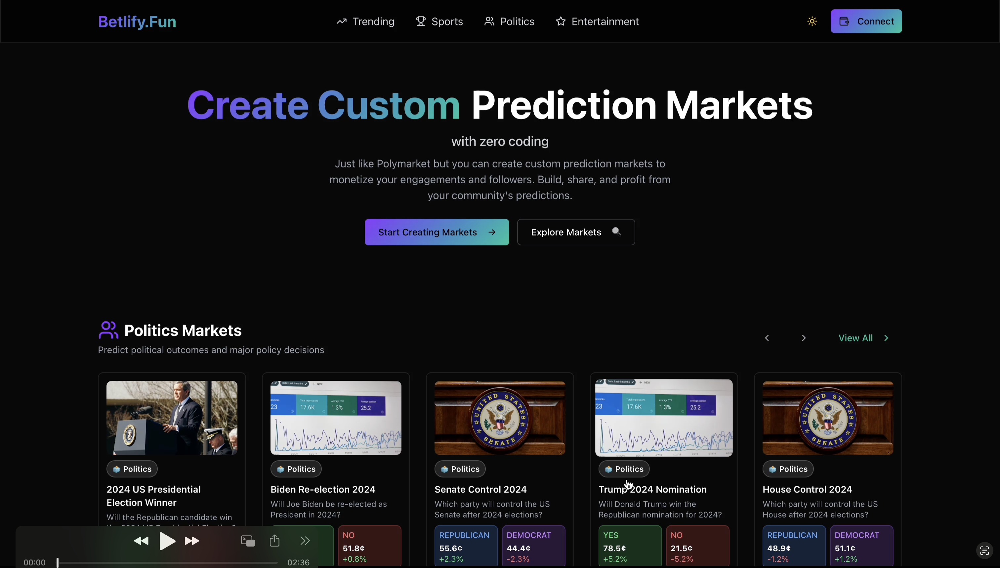

# Betlify.fun: Cross-Chain Prediction Markets Builder on Solana

> **Decentralized prediction markets with seamless cross-chain interoperability**

Betlify.fun is a no-code prediction market platform that enables anyone to create, participate in, and profit from custom prediction markets. Built on Solana with LayerZero v2 OApp integration, it provides true cross-chain functionality allowing users from any blockchain to participate seamlessly.

[](https://youtu.be/sW7ecSF0cFI)

## 🎯 Core Concept

Unlike traditional prediction markets that restrict users to curated markets, Betlify.fun empowers individuals to create markets around any topic or event. Market creators earn a percentage of pool funds, incentivizing high-quality, engaging markets. The platform's cross-chain architecture breaks down blockchain silos, opening up liquidity and participation from across the entire ecosystem.

## 🔄 Cross-Chain Architecture Flow

```
                                    ┌─────────────────┐
                                    │   Betlify.fun   │
                                    └─────────┬───────┘
                                              │
                                              ▼
                                    ┌─────────────────┐
                                    │  User Actions   │
                                    │ Create Pool, Place Bet, Claim Winnings │
                                    └─────────┬───────┘
                                              │
                                              ▼
                    ┌─────────────────────────────────────────────────┐
                    │                                                 │
                    ▼                                                 ▼
            ┌─────────────────────┐                         ┌─────────────────────┐
            │ EVM Users           │                         │ Solana Users        │
            │ (Ethereum, Polygon, etc.)                     │                     │
            └─────────┬───────────┘                         └─────────┬───────────┘
                      │                                                 │
                      ▼                                                 ▼
            ┌─────────────────────┐                         ┌─────────────────────┐
            │ Borsh Serialization │                         │ Betlify Solana      │
            └─────────┬───────────┘                         │ Program             │
                      │                                     └─────────────────────┘
                      ▼
            ┌─────────────────────┐
            │ EVM Contract        │
            │ (BetlifyEvm Adapter)│
            └─────────┬───────────┘
                      │
                      ▼
            ┌─────────────────────┐
            │ LayerZero Executor  │
            └─────────┬───────────┘
                      │
                      ▼
            ┌─────────────────────┐
            │ Betlify Solana      │
            │ Program             │
            └─────────────────────┘
```

## 🏗️ Technical Architecture Deep Dive

### 🦀 Rust/Anchor Smart Contracts

The core of Betlify.fun is built with **Rust and the Anchor framework**, providing type-safe, efficient smart contracts on Solana.

#### Program Structure
```
programs/my_oapp/src/
├── lib.rs                    # Main program entry point
├── instructions/             # Core betting logic
│   ├── create_pool.rs        # Market creation with PDA
│   ├── place_bet.rs          # Bet placement with validation
│   ├── resolve_market.rs     # Market resolution
│   ├── claim_winnings.rs     # Payout processing
│   └── lz_receive.rs         # Cross-chain message handler
├── state/                    # Account data structures
│   ├── bet_pool.rs           # Pool state management
│   ├── bet.rs                # Individual bet tracking
│   ├── store.rs              # Global program state
│   └── peer_config.rs        # LayerZero peer configuration
└── msg_codec.rs              # Anchor serialization/deserialization of BetlifyMessage
```

### 🔐 Program Derived Addresses (PDAs)

Betlify.fun leverages **deterministic PDAs** for efficient account management and cross-chain coordination:

#### Core PDA Seeds
```rust
// Store account - Global program state
seeds = [b"Store"]

// BetPool accounts - Unique per creator and pool ID
seeds = [b"betpool", creator.key().as_ref(), &pool_id.to_le_bytes()]

// Bet accounts - Unique per user and pool
seeds = [b"bet", user.key().as_ref(), bet_pool.key().as_ref()]

// Peer configuration - LayerZero cross-chain setup
seeds = [PEER_SEED, &store.key().to_bytes(), &src_eid.to_be_bytes()]
```

#### PDA Benefits
- **Deterministic Addressing**: Predictable account addresses across chains
- **Gas Efficiency**: No need to store account addresses in messages
- **Cross-Chain Coordination**: EVM contracts can derive Solana account addresses
- **Security**: Prevents account collision and unauthorized access

### 📨 Cross-Chain Message Serialization

#### Borsh Serialization Architecture

Betlify.fun uses **Borsh serialization** for efficient cross-chain message passing:

```rust
#[derive(AnchorSerialize, AnchorDeserialize, Clone, Debug, PartialEq)]
pub enum BetlifyMessage {
    CreatePool {
        question: String,
        options: Vec<String>,
        pool_id: u64,
        start_time: i64,
        lock_time: i64,
        end_time: i64,
    },
    PlaceBet {
        pool_id: u64,
        option: u8,
        amount: u64,
    },
    ResolveMarket {
        pool_id: u64,
        winning_option: u8,
    },
    ClaimWinnings {
        pool_id: u64,
    },
}
```

#### Frontend Encoding Using Borsh (TypeScript)

To pass structured BetlifyMessage that is compatible with Anchor's Deserialize, we used borsh to encode and serialize messages.
```typescript
// Borsh schema for CreatePool message
const createPoolSchema = borsh.struct([
  borsh.u8("variant"),
  borsh.str("question"),
  borsh.vec(borsh.str(), "options"),
  borsh.u64("pool_id"),
  borsh.i64("start_time"),
  borsh.i64("lock_time"),
  borsh.i64("end_time"),
]);

// Encode message for cross-chain transmission
export function encodeBetlifyMessage(message: BetlifyMessage): Buffer {
  const buffer = Buffer.alloc(1000);
  schema.encode(data, buffer);
  return buffer.subarray(0, schema.getSpan(buffer));
}
```

#### Solana Deserialization

Function to handle deserialization in Betlify Solana Program
```rust
// Decode incoming cross-chain messages
match msg_codec::decode_betlify_message(&params.message) {
    Ok(betlify_msg) => {
        match betlify_msg {
            BetlifyMessage::CreatePool { question, options, pool_id, .. } => {
                // Create new pool with deterministic PDA
                let bet_pool = &mut ctx.accounts.bet_pool;
                bet_pool.id = pool_id;
                bet_pool.question = question;
                // ... initialize pool state
            }
            // ... handle other message types
        }
    }
    Err(err) => return Err(BetlifyError::InvalidMessage.into())
}
```

### 🔗 EVM contract logic to send BetlifyMessages

The EVM contract contains one primary method to send Betlify Messages.

#### EVM Side (Solidity)
```solidity
// BetlifyEvmAdapter.sol - Cross-chain interface
contract BetlifyEvmAdapter is Ownable, OApp, OAppOptionsType3 {
    function sendBetlifyAction(
        uint32 dstEid,
        bytes calldata message,
        bytes calldata optionsData
    ) external payable returns (MessagingReceipt memory receipt) {
        bytes memory lzOptions = combineOptions(dstEid, 1, optionsData);
        receipt = _lzSend(dstEid, message, lzOptions, MessagingFee(msg.value, 0), payable(msg.sender));
    }
}
```


### 🎨 Frontend Architecture

**Modern React + TypeScript** frontend with comprehensive cross-chain support:

```
frontend/client/src/
├── components/                # Reusable UI components
│   ├── market-card.tsx        # Market display component
│   ├── market-carousel.tsx    # Market browsing
│   ├── wallet-connect-modal.tsx # Multi-chain wallet support
│   └── ui/                    # Design system components
├── pages/                     # Main application pages
│   ├── home.tsx               # Market discovery
│   ├── create-market.tsx      # Market creation interface
│   └── bet-details.tsx        # Detailed market view
├── contexts/                  # State management
│   └── WalletContext.tsx      # Multi-chain wallet context
├── hooks/                     # Custom React hooks
├── lib/                       # Contract interactions
│   ├── contracts.ts           # Solana program client
│   ├── encodeBetlifyMessage.ts # Borsh encoding utilities
│   └── solana-contracts.ts    # Solana-specific utilities
└── types/                     # TypeScript type definitions
```

### Deployment details.

- Solana OApp Program ID: EzSWvfipsRAQxPspMFm9QVot1jHwAGxKYWtnNi8YFT5R
- Solana OApp Address (Store): 7zT3rAb8tNAK8mSewyxRz7ubbDtnXEcSaoJnyVyg4f8n
- EVM OApp Address: 0x2ED9929e3AA3CAd3553aA90014894300D3Fa224d
- [LayerZero Scan: ](https://testnet.layerzeroscan.com/address/7zT3rAb8tNAK8mSewyxRz7ubbDtnXEcSaoJnyVyg4f8n) https://testnet.layerzeroscan.com/address/7zT3rAb8tNAK8mSewyxRz7ubbDtnXEcSaoJnyVyg4f8n

## 🚀 Getting Started

### Prerequisites
- Node.js 18+
- Rust 1.70+
- Solana CLI
- Anchor CLI

### Quick Start

1. **Clone and setup**
   ```bash
   git clone https://github.com/yourusername/betlify.fun.git
   cd betlify.fun
   ```

2. **Build Solana programs**
   ```bash
   cd programs/my_oapp
   cargo build
   anchor build
   ```

3. **Deploy contracts**
   ```bash
   # Deploy Solana program
   anchor deploy
   
   # Deploy EVM adapter
   npx hardhat deploy --network <network>
   ```

4. **Configure LayerZero endpoints**
   ```bash
   # Update lib/config.ts with your LayerZero endpoints
   ```

5. **Run frontend**
   ```bash
   cd frontend/client
   npm install
   npm run dev
   ```

## 🔧 Development

### Building and Testing
```bash
# Solana program development
anchor build
anchor test

# EVM contract testing
npx hardhat test

# Cross-chain integration testing
cd test/betlify-test
npm run test:cross-chain
```

### Key Development Commands
```bash
# Verifiable build with environment variable
anchor build -v -e MYOAPP_ID=<OAPP_PROGRAM_ID>

# Generate client SDK
cd lib && npm run generate

# Deploy to specific networks
npx hardhat deploy --network optimism-testnet
npx hardhat deploy --network solana-testnet
```

## 📊 Project Structure

```
betlify.fun/
├── programs/my_oapp/          # 🦀 Solana smart contracts (Rust/Anchor)
│   ├── src/
│   │   ├── instructions/      # Core betting logic
│   │   ├── state/             # Account data structures
│   │   ├── msg_codec.rs       # Borsh serialization
│   │   └── lib.rs             # Program entry point
│   └── Cargo.toml
├── contracts/                 # 🔗 EVM contracts (Solidity)
│   ├── BetlifyOApp.sol        # Cross-chain adapter
│   └── libs/BetlifyMsgCodec.sol # Message encoding
├── frontend/client/           # 🎨 React frontend
├── lib/                       # 📚 SDK and utilities
│   ├── client/                # Generated Solana client
│   └── scripts/               # Deployment and testing
├── deploy/                    # 🚀 Deployment scripts
├── test/                      # 🧪 Test suites
└── docs/                      # 📖 Documentation
```

## 🗺️ Roadmap

### Phase 1: Core Platform ✅
- [x] Solana smart contracts with PDA architecture
- [x] LayerZero v2 OApp integration
- [x] Borsh cross-chain message serialization
- [x] Basic frontend interface

### Phase 2: Enhanced Features 🚧
- [ ] OFT (Omnichain Fungible Token) integration for cross-chain payouts
- [ ] Advanced market resolution mechanisms
- [ ] Dispute resolution system
- [ ] Community governance features

### Phase 3: Ecosystem Growth 📈
- [ ] Open API for third-party integrations
- [ ] Mobile app development
- [ ] Advanced analytics dashboard
- [ ] Institutional features

## 🤝 Contributing

We welcome contributions! Please see our [Contributing Guidelines](CONTRIBUTING.md) for details.

### Development Guidelines
- Follow Rust/Anchor best practices for Solana programs
- Use TypeScript for frontend development
- Write comprehensive tests for all new features
- Document your code and APIs
- Ensure cross-chain compatibility

## 📄 License

This project is licensed under the MIT License - see the [LICENSE](LICENSE) file for details.

## 🙏 Acknowledgements

- **[LayerZero](https://layerzero.network/)** - Cross-chain messaging infrastructure
- **[Anchor](https://www.anchor-lang.com/)** - Solana smart contract framework
- **[Solana](https://solana.com/)** - High-performance blockchain platform
- **[Borsh](https://borsh.io/)** - Binary serialization format

---

**Betlify.fun — Own the market. Predict the future. From any chain.**
